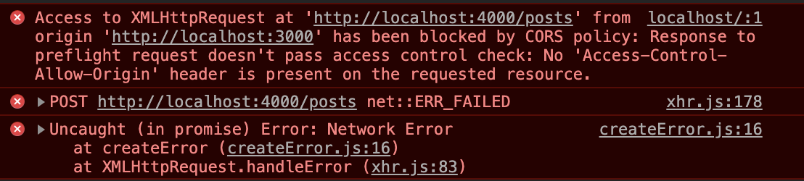

# Mini Microservices Application

## **Description**

1. Create Posts
2. Add comments to each post

## **Services to create**

Here, we consider the number of resources we have, namely: 
1. Post 
2. Comment 

So, there will be 2 services in this application

## **Functionality Required**

1. Posts
    1. Create Posts
    2. List all Posts
2. Comments
    1. Create comments - Associated with posts (**Dependency**)
    2. List all Comments  - Only for specific posts

## **First Steps**

1. Create React App
2. Express Server for Posts
3. Express Server for Comments

## **Introspection**

- **Posts**
    - GET /posts - All posts
    - POST /posts - Create a post

    ```jsx
    request.body = {title: string}
    ```

- **Comments**
    - GET /posts/:id/comments - Get all the comments corresponding to a particular post
    - POST /posts/:id/comments - Create a comment corresponding to a particular post

    ```jsx
    request.body = {content: string}
    ```

- **Create React App**

    ```mermaid
    graph TD;
        App --> Posts_Create;
        App --> List_Posts;
        List_Posts --> Comments_Create;
        List_Posts --> List_Comments;

    ```

    **CORS Error is very common in Micro-services architecture (see below)**

    There is a need to make some configuration changes to our post and comment service, i.e. we need to make sure our server uses the 'cors' package on the express app.

    

[[ Request Minimisation ]]