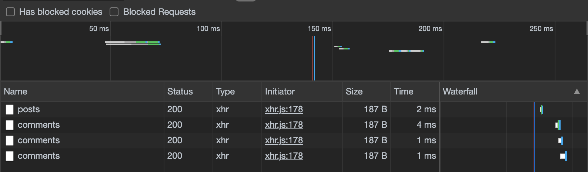

# Request Minimisation

In the initial implementation, we had to call for comments for every post. This is a **very easy problem** to solve in a monolith.



To solve this, we can have a number of solutions, namely:

1. **Sync communication** :x: - Internally configure the posts service to use the comments service, to fetch the comments. 
2. **Async Communication** :white_check_mark: - Create a event bus, and possibly a query service that arranges all our data in an O(1) retrieval DS. 
    1. Advantages
        1. No dependencies on other services
        2. Fast lookup
    2. Disadvantages
        1. Data duplication

## Event Bus

There are many industry solutions like RabbitMQ, Kafka etc.

They receive events and publish these to services that are listening for these events.

For our event bus implementation, we will

- Create a simple express server
- Every service in our application will now have a new route to call this event bus
- Our event bus will then, send off the information of this event to all the services in our application, including the emitter. This is done via simple post requests to each service on the endpoint **POST /events**.

**Note: This is a very simple implementation**


_Comments service receives a PostCreated event. The event-bus after implementation basically need to notify all the services of the events that occur._

After having implemented the Event-bus we can now relay these events to our Query Service which can handle all these events as required.

This Query Service can then service the GET requests in other services.

## Query Service

```jsx
posts = {
	'xyz': {
		id: 'xyz',
		title: 'Mah name Jeff',
		comments: [
			{
				id: 'abcd',
				content: '*Jeff Goldblum intensifies*'
			}
		]
	}
}
```

We store all our posts in an object for convenience.

The query service hence has only 2 endpoints, namely:

1. **POST /events** - To ingest emitted events
2. **GET /posts** - Returns all the posts to be displayed by the application

**Note** : The Post and Comment service are still very essential for the application. The query service merely gets the data for the frontend, reducing the number of requests made.


Now, we can reduce the network calls drastically.

Also, now even if the posts and the comments service are down, the query service is the only one which is required to render *at-least* the existing state of the application, hence making our website more robust